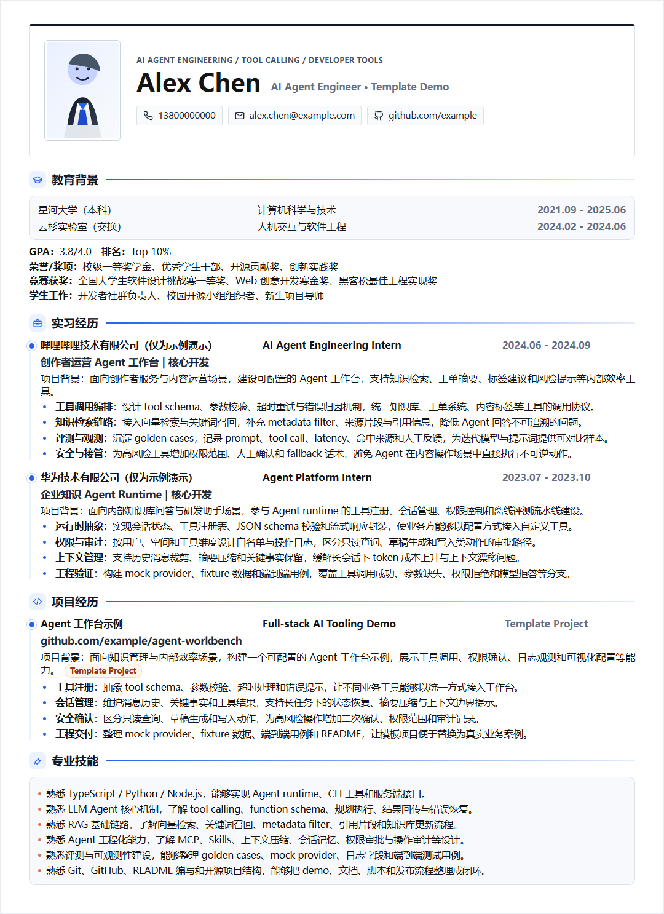

# VibeResume Editor

[](LICENSE)
[](package.json)
[](serve.py)
[](scripts/export-pdf.mjs)

一个可视化编辑、可保存、可导出 PDF 的网页简历模板。

本项目从 [**Vibe Resume 项目二改**](https://github.com/LiuMengxuan04/vibe-resume) 而来，在原有 HTML/CSS 简历与 Chromium 导出流程基础上，增加了左侧可视化编辑器、富文本加粗/斜体、撤销、块排序、统一后台服务和一键启动脚本。公开仓库中的简历内容均为 mock 模板，不包含真实个人经历。



## 功能

- `index.html` 是简历内容源文件，编辑器每次都从它读取最近保存的内容。
- `editor.html` 提供左右分栏编辑体验：左侧编辑字段，右侧预览简历。
- 支持富文本加粗和斜体：选中文字后使用悬浮工具条，或使用 `Ctrl+B` / `Ctrl+I`。
- 支持 `Ctrl+S` 保存到 `index.html`，`Ctrl+Z` 撤销误操作。
- 支持实习经历、项目经历和亮点 bullet 的上下移动排序。
- 支持一键导出 PDF，服务端使用 Chromium 渲染网页布局。
- Windows 用户可直接双击 `start.bat` 启动编辑器。

## 快速开始

安装依赖：

```bash
npm install
```

Windows 一键启动：

```bat
start.bat
```

或者使用命令行启动统一服务：

```bash
npm run preview
```

打开：

```text
http://127.0.0.1:4173/editor.html
```

导出示例 PDF：

```bash
npm run export:pdf
```

默认输出：

```text
export/vibe-resume-demo.pdf
```

## 使用方式

1. 打开 `editor.html`。
2. 在左侧修改姓名、教育、实习、项目和技能。
3. 选中左侧富文本里的局部文字，使用悬浮工具条设置加粗或斜体。
4. 修改完成后点击“刷新”或让输入框失焦，右侧预览会更新。
5. 使用 `Ctrl+S` 或按钮保存到 `index.html`。
6. 点击“导出 PDF”生成简历文件。

如果只想静态预览简历，也可以直接打开 `index.html`。

## 模板内容说明

当前模板使用 `Alex Chen` 作为默认示例人物，电话、邮箱、学校、公司、经历和技能均为 mock 内容。

- `assets/avatar-placeholder.svg` 是默认 SVG 占位头像，不是真人照片。
- 哔哩哔哩和华为名称只作为示例演示，模板中已标注 `（仅为示例演示）`。
- 项目经历使用通用 mock 示例，链接为 `github.com/example/...` 占位地址。
- 用户发布自己的公开仓库前，应替换或删除所有真实手机号、邮箱、照片、学校和经历。

## 隐私与公开发布

**重要：公开发布前请务必注意以下事项**

- `index.html` 默认已加入 `.gitignore`，不会被推送到 GitHub。
- 本地编辑器和导出流程使用 `index.html` 保存你真实的简历数据。
- `index.template.html` 是公开仓库中的模板文件（Alex Chen mock 数据），供其他用户克隆使用。
- 如果你需要更新公开模板，请修改 `index.template.html` 后提交。
- 不要提交真人证件照、身份证明、手机号、私人邮箱或未公开履历。
- 不要把真实个人简历 PDF 放进 `export/` 后公开。
- 如果仓库历史里曾提交过隐私文件，不能直接把旧历史推到公开仓库。
- 推荐新建一个干净仓库，只用当前清理后的文件作为首个公开 commit。

## 项目结构

```text
.
├── assets/
│   ├── logos/
│   │   ├── bilibili-color.svg
│   │   └── huawei-color.svg
│   ├── avatar-placeholder.svg
│   └── preview.png
├── export/
│   └── vibe-resume-demo.pdf
├── scripts/
│   ├── export-pdf.mjs
│   └── verify-editor-load.mjs
├── skills/
│   └── vibe-resume-editor/
│       └── SKILL.md
├── editor.html
├── index.html          ← 本地使用（.gitignore 保护，不推送）
├── index.template.html ← 公开模板（Alex Chen mock 数据）
├── serve.py
├── start.bat
├── start.sh
├── styles.css
├── package.json
└── README.md
```

## 核心文件

- `index.html` 是简历展示页，也是编辑器保存后的源文件（已加入 `.gitignore`，不推送公开仓库）。
- `index.template.html` 是公开仓库中的模板文件（Alex Chen mock 数据），克隆后可复制为 `index.html` 使用。
- `editor.html`：可视化编辑器，包含表单、富文本工具条、预览和导出入口。
- `styles.css`：简历展示样式。
- `serve.py`：统一后台服务，负责静态文件、保存接口和 PDF 导出接口。
- `scripts/export-pdf.mjs`：使用本机 Chrome / Chromium 导出 PDF。
- `scripts/verify-editor-load.mjs`：验证编辑器是否从 `index.html` 正确加载模板内容。

## 开发验证

检查 Python 服务语法：

```bash
python -m py_compile serve.py
```

检查导出脚本语法：

```bash
node --check scripts/export-pdf.mjs
```

启动服务后验证编辑器加载：

```bash
node scripts/verify-editor-load.mjs
```

重新生成示例 PDF：

```bash
npm run export:pdf
```

## 可执行文件打包可行性

未来可以打包成便携式可执行文件。推荐路线是把 `serve.py` 或一个轻量 Node 服务打包为本地后台程序，并随包携带静态文件和启动脚本。需要额外处理：

- Chrome / Chromium 依赖：使用系统 Chrome，或随包携带 Chromium。
- 写入目录：保存 `index.html` 和导出 PDF 时需要可写路径。
- 端口占用：启动时探测端口并给出清晰提示。
- 隐私安全：不要把用户生成的真实简历放入模板安装目录。

## English

VibeResume Editor is a web-first resume template with a visual editor and Chromium-based PDF export. It is a modified version of the Vibe Resume project, adding a local editor, rich-text formatting, undo, section ordering, a unified backend service, and Windows one-click startup.

The repository uses mock resume content only. Replace all placeholders before using it as a real resume.

## License

[MIT](LICENSE)
